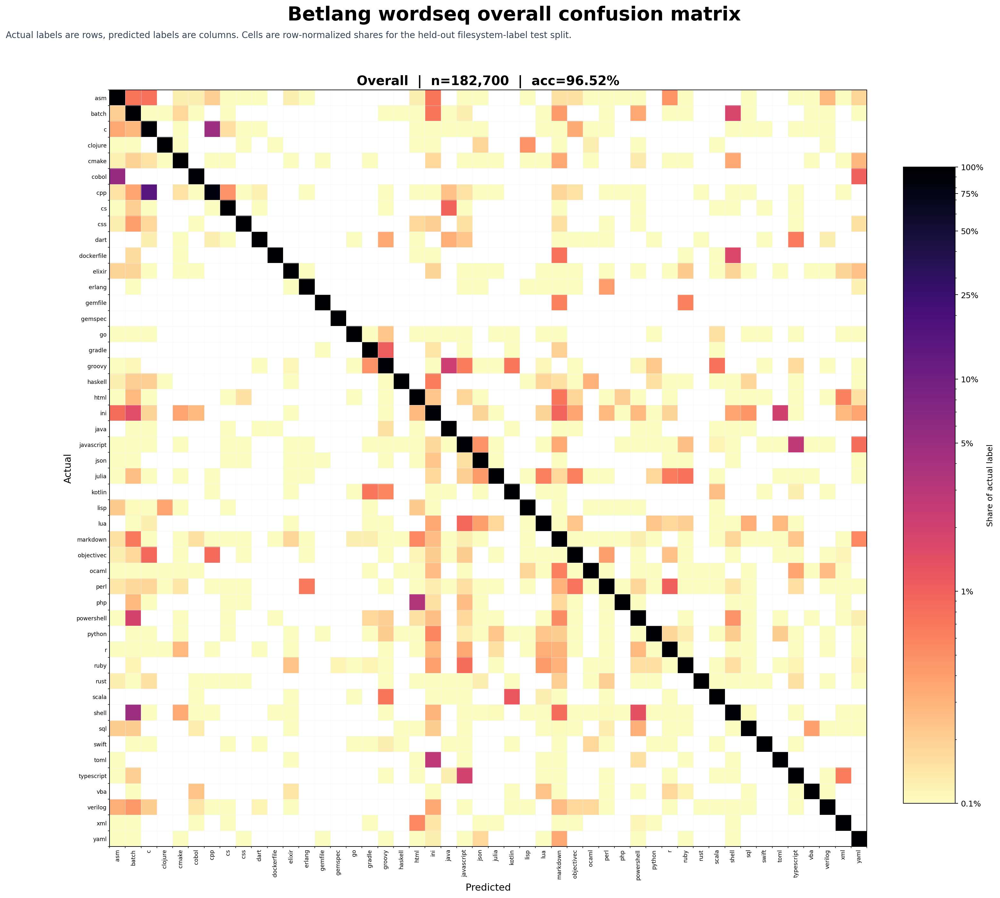

# Betlang

[](https://crates.io/crates/betlang)
[](https://docs.rs/betlang)

CPU source-language detection for code with a tiny 50kb model.

```toml
[dependencies]
betlang = "0.1.0"
```

```rust
let detection = betlang::detect("fn main() { println!(\"hi\"); }");

assert_eq!(detection.language(), Some(betlang::Language::Rust));
```

Use `betlang::detect(source)` for UTF-8 source strings or byte slices. It
returns a `Detection`; call `Detection::language()` to read the top language.
Call `Detection::top_languages()` when you need ranked probabilities.

## Supported Languages

Slugs parse through the standard `FromStr` implementation:

```rust
assert_eq!("rust".parse::<betlang::Language>(), Ok(betlang::Language::Rust));
```

`asm`, `awk`, `batch`, `bash`, `c`, `c-sharp`, `clojure`, `cmake`, `cobol`,
`commonlisp`, `cpp`, `css`, `dart`, `diff`, `dockerfile`, `elixir`, `erlang`,
`go`, `groovy`, `haskell`, `hcl`, `html`, `ini`, `java`, `javascript`,
`jinja2`, `json`, `julia`, `kotlin`, `lua`, `markdown`, `matlab`, `objc`,
`ocaml`, `perl`, `php`, `postscript`, `powershell`, `prolog`, `python`, `r`,
`ruby`, `rust`, `scala`, `scss`, `solidity`, `sql`, `starlark`, `swift`,
`textproto`, `toml`, `typescript`, `vb`, `verilog`, `vhdl`, `vue`, `xml`,
`yaml`, `zig`.

The confusion matrix for the model's 48 embedded classes:



## Model

The embedded model is `assets/magika/source-student-q4.bin`, a 47,840-byte
weights-only MSQ1 payload with SHA-256:

```text
59ef24167bddd1364eb9c1650add8a67e1a542b5155fac67f5e1cda07df0c0f0
```

Architecture: `wordseq-b1024-k3-m2048-tiny-3conv-hidden`, tokenizer version 3.
On the manifest-aligned held-out filesystem-label test split it reaches
`test_fs_accuracy=0.965238` with `macro_recall=0.965411`.

See [MODEL_CARD.md](MODEL_CARD.md) for the training and evaluation summary.

## Performance

Betlang uses a fixed 4096-byte Magika window and pads runtime inference to the
same 2048-token shape used by evaluation. The model is loaded once per process
and then reused through a `OnceLock`.

Native CPU inference dispatches through `fearless_simd`. Benchmark entry points
are available through `cargo bench`. Current baseline numbers are tracked in
[BENCHMARKS.md](BENCHMARKS.md).

## License And Attribution

Betlang is licensed under MIT. The embedded student model was trained from
outputs of Google's Magika teacher model; Magika is published by Google under
Apache-2.0. Keep this attribution with redistributed model artifacts.

## Confusion By File Size

The shipped wordseq model is evaluated below on the held-out `bigorig` test
split. Each panel is a row-normalized confusion matrix for one file-size
bucket: actual labels are rows, predicted labels are columns, and the diagonal
is correct classification.


