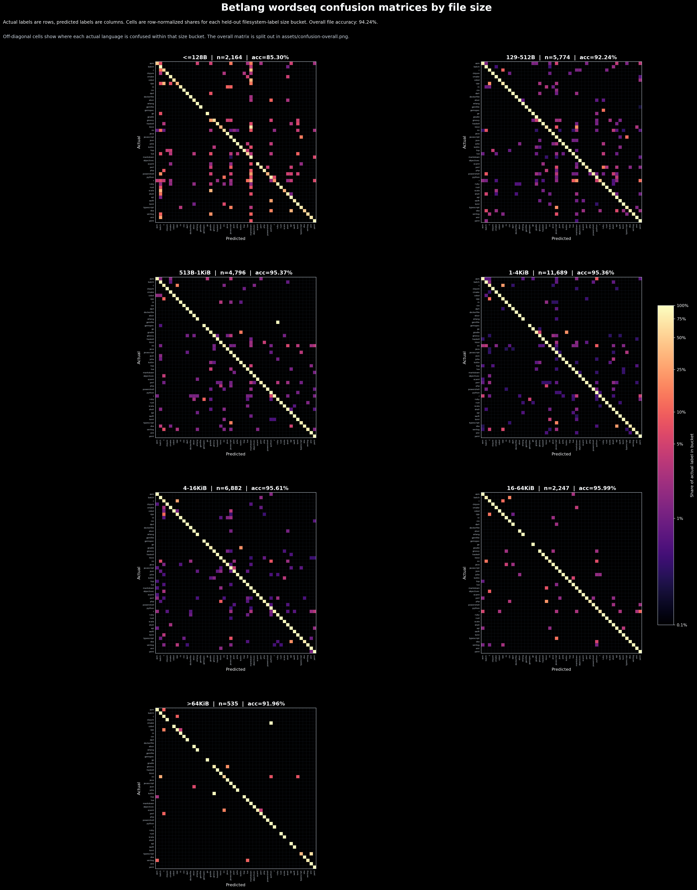

# Betlang

[](https://crates.io/crates/betlang)
[](https://crates.io/crates/betlang)
[](https://docs.rs/betlang)
[](https://github.com/ealmloff/betlang/actions/workflows/ci.yml)

CPU source-language detection for code, backed by a compact Magika student
model.

```toml
[dependencies]
betlang = "0.0.1"
```

```rust
let detection = betlang::detect("fn main() { println!(\"hi\"); }");

assert_eq!(detection.language(), Some(betlang::Language::Rust));
```

Use `betlang::detect(source)` for UTF-8 source strings. Use
`betlang::detect_bytes(bytes)` for scanners that already work with file bytes
and should not reject non-UTF-8 input before classification. Both return a
`Detection`; call `Detection::language()` to read the top language.
Call `Detection::top_languages()` when you need ranked probabilities.

## Probabilities

`Detection::language()` returns `None` when Betlang cannot build a useful model
window. Empty input, whitespace-only input, and inputs with fewer than eight
non-whitespace bytes are not classified.

Probabilities are computed from the model logits with a softmax. Several
embedded model classes intentionally map to the same public language, so their
probabilities are added together before ranking public languages.

```rust
let detection = betlang::detect("fn main() { println!(\"hi\"); }");
let (probability, language) = detection.top_languages().next().unwrap();

assert_eq!(language, betlang::Language::Rust);
assert!(probability > 0.0);
```

## Stability

`Language` is `#[non_exhaustive]`. Adding a new public language variant is a
minor-version change after `1.0`, and callers should include a wildcard arm when
matching on it.

Model upgrades may change predictions, probabilities, or ranking in a minor
release. Removing a language, changing a public slug, or changing when
`Detection::language()` returns `None` is a breaking change after `1.0`.

## Supported Languages

Slugs parse through the standard `FromStr` implementation:

```rust
assert_eq!("rust".parse::<betlang::Language>(), Ok(betlang::Language::Rust));
```

`asm`, `awk`, `batch`, `bash`, `c`, `c-sharp`, `clojure`, `cmake`, `cobol`,
`commonlisp`, `cpp`, `css`, `dart`, `diff`, `dockerfile`, `elixir`, `erlang`,
`go`, `groovy`, `haskell`, `hcl`, `html`, `ini`, `java`, `javascript`,
`jinja2`, `json`, `julia`, `kotlin`, `lua`, `markdown`, `matlab`, `objc`,
`ocaml`, `perl`, `php`, `postscript`, `powershell`, `prolog`, `python`, `r`,
`ruby`, `rust`, `scala`, `scss`, `solidity`, `sql`, `starlark`, `swift`,
`textproto`, `toml`, `typescript`, `vb`, `verilog`, `vhdl`, `vue`, `xml`,
`yaml`, `zig`.

Several embedded model classes intentionally map to one public language. For
example, `erb`, `gemfile`, and `gemspec` map to `ruby`; `jsonl` maps to `json`;
`shell` maps to `bash`; and project-file classes such as `csproj` and `vcxproj`
map to `xml`.

## Example CLI

The repository includes an example detector:

```bash
cargo run --release --example detect -- src/model.rs
cargo run --release --example detect < snippets/demo.rs
cargo run --release --example detect -- .
```

Directory mode respects `.gitignore` and prints a GitHub-style byte breakdown.
Files that are not valid UTF-8 are reported as unreadable by the example CLI;
library users can call `detect_bytes` directly.

## Model

The embedded model is `assets/magika/source-student-q4.bin`, a 102,793-byte
MSQ1 export with SHA-256:

```text
52be89bef15515aa93ae924e76d17d72b3943f50ceda8aa9e1c3834f27f8e883
```

Architecture: `wordseq-b1536-k3-m2048-med-3conv-hidden`, tokenizer version 3.
On the held-out `bigorig` test split it reaches
`test_teacher_parity=0.967618` and `test_fs_accuracy=0.962517`.

See [MODEL_CARD.md](MODEL_CARD.md) for the training and evaluation summary.

## Performance And Wasm

Betlang uses a fixed 4096-byte Magika window and pads runtime inference to the
same 2048-token shape used by evaluation. The model is loaded once per process
and then reused through a `OnceLock`.

Native CPU inference dispatches through `fearless_simd`. The repository also
includes wasm smoke tests:

```bash
rustup target add wasm32-unknown-unknown
cargo build --example wasm_smoke --target wasm32-unknown-unknown --release
node scripts/run-wasm-smoke.mjs \
  target/wasm32-unknown-unknown/release/examples/wasm_smoke.wasm
```

Benchmark entry points are available through `cargo bench` for native runs and
`scripts/bench-wasm.sh` for wasm runs. Current baseline numbers are tracked in
[BENCHMARKS.md](BENCHMARKS.md).

## License And Attribution

Betlang is licensed under MIT. The embedded student model was trained from
outputs of Google's Magika teacher model; Magika is published by Google under
Apache-2.0. Keep this attribution with redistributed model artifacts.

## Confusion By File Size

The shipped wordseq model is evaluated below on the held-out `bigorig` test
split. Each panel is a row-normalized confusion matrix for one file-size
bucket: actual labels are rows, predicted labels are columns, and the diagonal
is correct classification.


