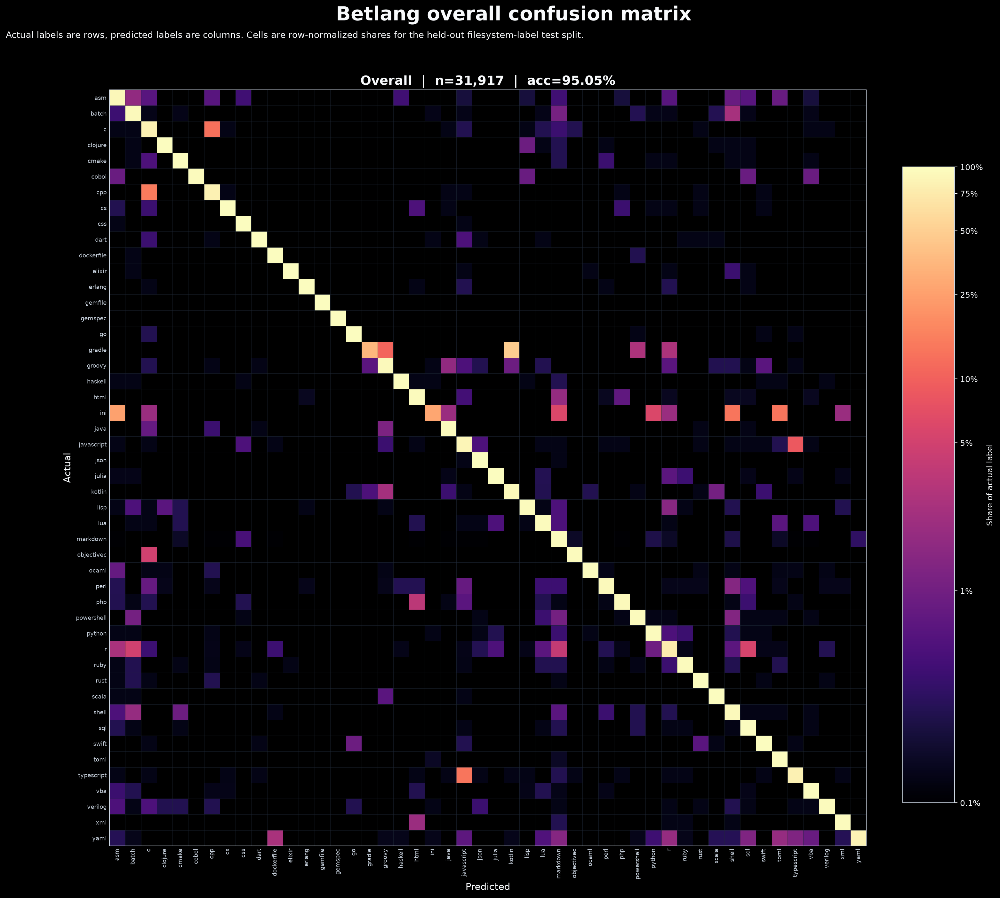
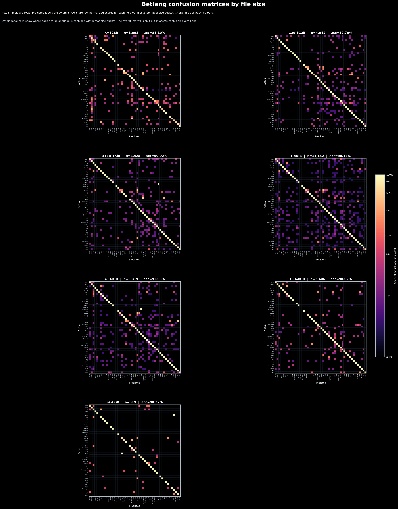

# Betlang

[](https://crates.io/crates/betlang)
[](https://docs.rs/betlang)

CPU source-language detection for code with a binary XOR/popcount model. Try it in browser [here](https://dioxuslabs.github.io/dioxus-code/#playground)

```toml
[dependencies]
betlang = "0.1.1"
```

```rust
let detection = betlang::detect("fn main() { println!(\"hi\"); }");

assert_eq!(detection.language(), Some(betlang::Language::Rust));
```

Use `betlang::detect(source)` for UTF-8 source strings or byte slices. It
returns a `Detection`; call `Detection::language()` to read the top language.
Call `Detection::top_languages()` when you need ranked probabilities.

## Supported Languages

Slugs parse through the standard `FromStr` implementation:

```rust
assert_eq!("rust".parse::<betlang::Language>(), Ok(betlang::Language::Rust));
```

`asm`, `batch`, `c`, `clojure`, `cmake`, `cobol`, `cpp`, `cs`, `css`, `dart`,
`dockerfile`, `elixir`, `erlang`, `gemfile`, `gemspec`, `go`, `gradle`,
`groovy`, `haskell`, `html`, `ini`, `java`, `javascript`, `json`, `julia`,
`kotlin`, `lisp`, `lua`, `markdown`, `objectivec`, `ocaml`, `perl`, `php`,
`powershell`, `python`, `r`, `ruby`, `rust`, `scala`, `shell`, `sql`, `swift`,
`toml`, `typescript`, `vba`, `verilog`, `xml`, `yaml`.

These are the model's 48 output labels. Runtime detections expose them
one-to-one with no label aggregation.

The confusion matrix uses the same labels:



## Model

The embedded model is `assets/magika/source-bloom.bin`, a 1,932,116-byte
weights-only MBL3 payload with SHA-256:

```text
4d01e7996aee5a9cd5c3582fa97ca025390276cdea022b7594f46ec69da57616
```

Architecture: a deterministic counting-Bloom n-gram signature (byte n-grams,
case-folded words, and tokenizer-v3 unit n-grams hashed into 78 binary planes
of 4,096 bits) followed by a binary {-1,+1} linear head evaluated entirely
with XOR + popcount plus one float multiply-add per (class, plane). On the
rebuilt held-out filesystem-label test split it reaches
`test_fs_accuracy=0.947959` versus `0.944888` for the previous convolutional
student on the same split.

See [MODEL_CARD.md](MODEL_CARD.md) for the training and evaluation summary.

## Performance

Betlang uses a fixed 4096-byte Magika window. The byte window is hashed into a
319,488-bit binary signature and the 48 logits are computed with XOR +
popcount over packed u64 words. The model is loaded once per process and then
reused through a `OnceLock`.

Benchmark entry points are available through `cargo bench`. Current baseline
numbers are tracked in [BENCHMARKS.md](BENCHMARKS.md); the binary model is
~24x faster than the previous convolutional student on short inputs and ~90x
faster on full 4 KiB windows on the same host.

## License And Attribution

Betlang is licensed under MIT. The embedded model was trained with soft
targets from Google's Magika teacher model; Magika is published by Google
under Apache-2.0. Keep this attribution with redistributed model artifacts.

## Confusion By File Size

The shipped model is evaluated below on the held-out test split. Each panel is
a row-normalized confusion matrix for one file-size bucket: actual labels are
rows, predicted labels are columns, and the diagonal is correct
classification.


